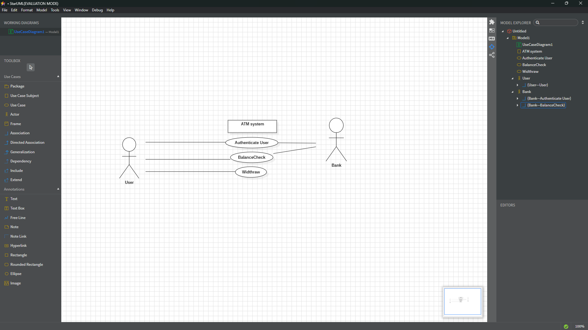
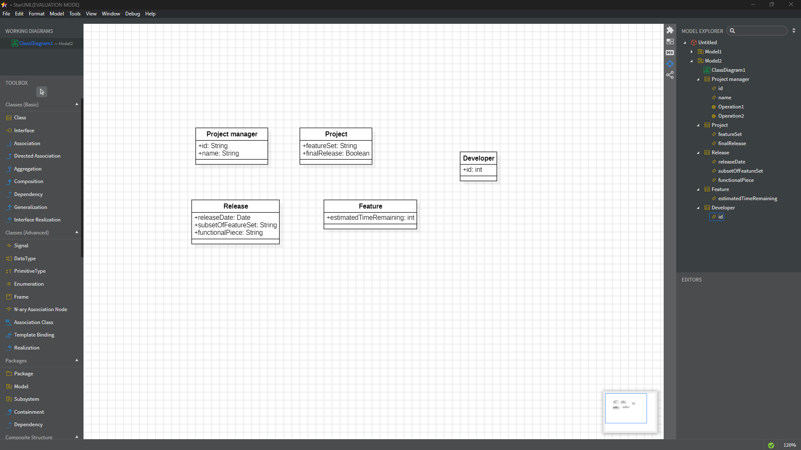
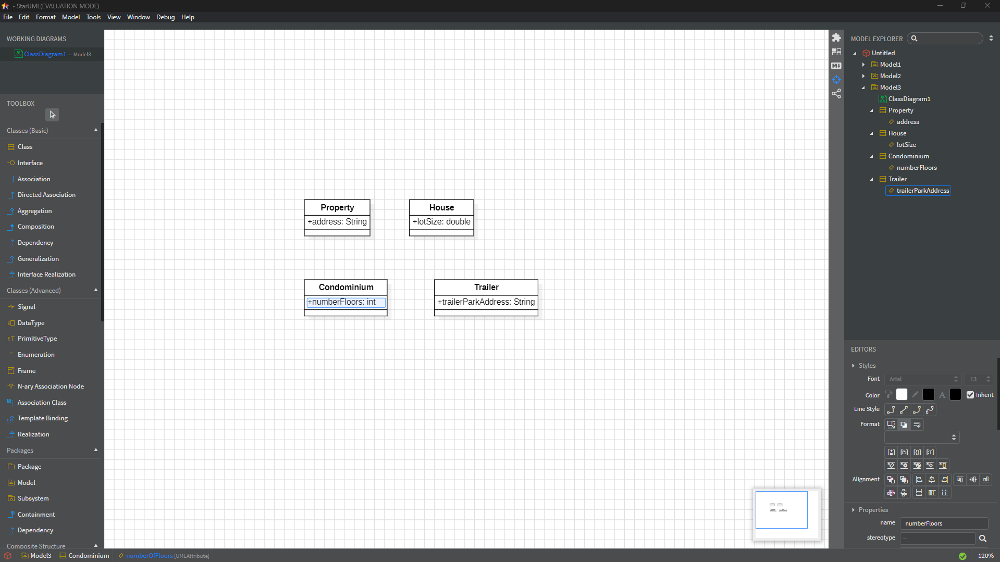

Use Case Description:

| User Action                             | System Response                                                                 |
| --------------------------------------- | ------------------------------------------------------------------------------- |
| 1. User types in PIN into main screen   | 1. System checks validity of PIN and presents options to user on another screen |
| 2. User selects "Withdraw Money" option | 2. System displays screen to enter withdrawal amount                            |
| 3. User enters amount and confirms      | 3. System checks balance, dispenses cash, and updates account balance           |

ATM User Story:

- As an ATM user, I want to withdraw cash from my account, first I should enter my PIN, then choose the withdraw option, and receive the specified amount of money only if my balance allows it.

The bank actor should maybebe be like an organisation (Squere) or something not like stick figure, right?

3. the porject management tracking system:

4. Properties Management system

As you mentionned, no need to implement the relations and the methods.
The Property class has an abstract methhod calculateRent(), so eachh type (House, condo, trailer) must override it with its own formula, in order to let each one handle rent in its own way using (polymorphism).